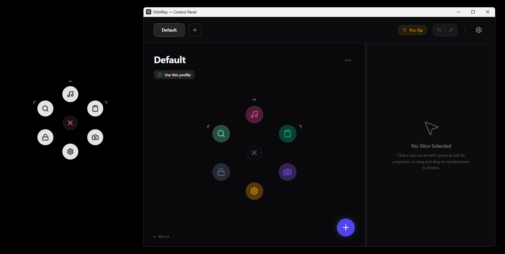
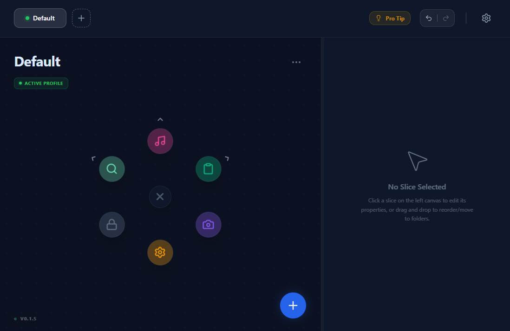
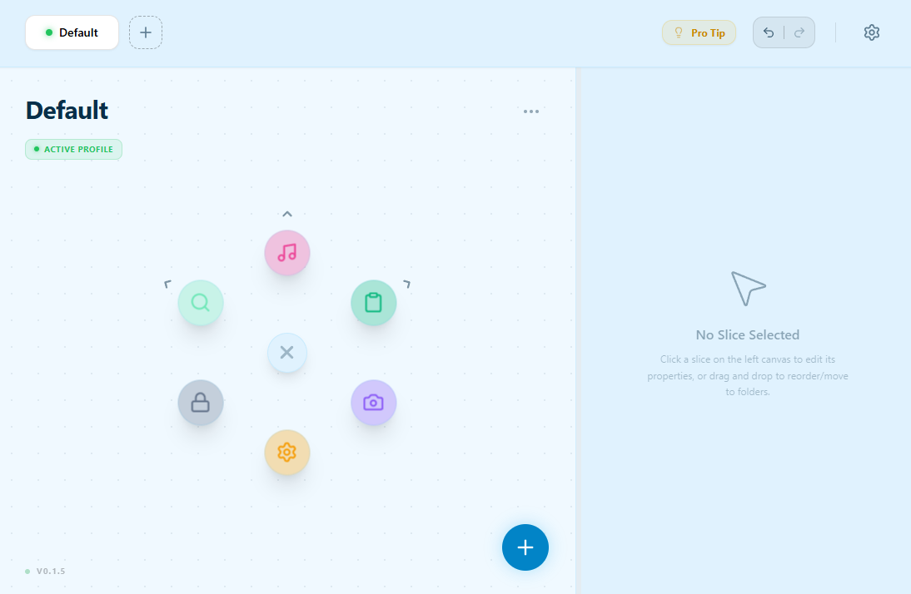
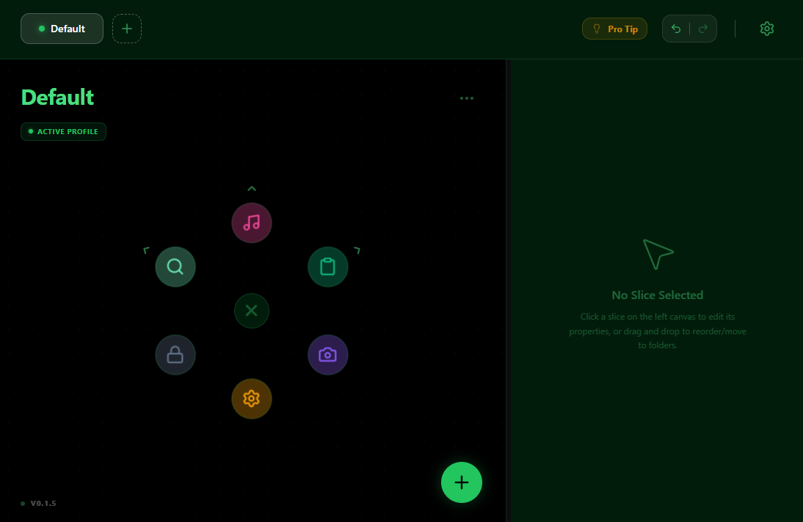
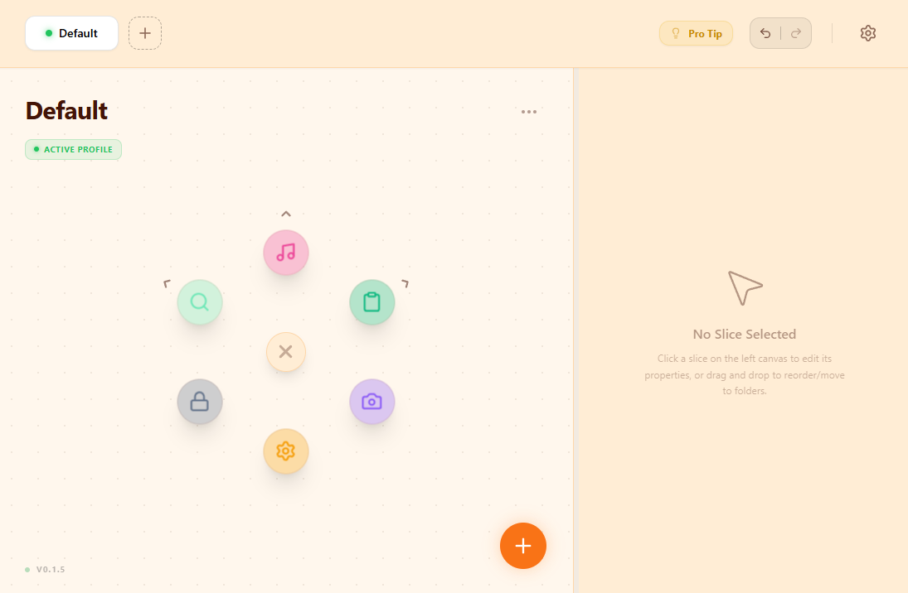

<div align="center">
  
  <h1>OrbitKey</h1>
  <p><b>High-speed Command Hub for Power Users.</b></p>
  <p><i>Summon a beautiful, adaptive radial menu at your cursor and execute macros with zero friction.</i></p>

  <p>
    <a href="https://v2.tauri.app"></a>
    <a href="https://react.dev/"></a>
    <a href="https://www.rust-lang.org/"></a>
    <a href="https://tailwindcss.com/"></a>
  </p>
  <p>
    
    <a href="https://opensource.org/licenses/MIT"></a>
  </p>
</div>

<br />

**OrbitKey** is a productivity-enhancing desktop application inspired by [Kando](https://github.com/kando-menu/kando) and the Logitech Action Ring. It allows you to run scripts, launch apps, trigger complex keyboard shortcuts, and manage your workflow via a fluid, beautifully animated radial menu.

---

## 📸 Showcase

<p align="center">
  
</p>

---

## ✨ Key Highlights

* **⚡ Lightning Fast:** Built with Rust (Tauri v2) for a minimal resource footprint, enabling instant summoning via global hotkeys without interrupting your current task.
* **🎯 Radial Precision (Wedge Selection):** Say goodbye to precise clicking. Move your mouse in the general direction of the action to select it instantly via intuitive directional vectors.
* **📂 Smart Folders:** Keep your hub clutter-free. Group actions into nested menus that expand and collapse with smooth spring animations.
* **🎨 Adaptive Themes:** Match your vibe. Features built-in themes (Cyber Dark, Neon Matrix, Peach Milk, etc.) that customize the entire application's UI, from the control panel to the action ring itself.
* **⚙️ Master Control Panel:** Easily create, manage, and arrange your profiles and macros through a dedicated, beautifully designed dashboard.
* **📦 Auto-Release CI/CD:** Integrated GitHub Actions for automatic builds of installers (`.exe`, `.dmg`) upon every version tagging.

---

## 🎬 Action Ring in Motion

<div align="center">
  <table width="100%">
    <tr>
      <td align="center" width="36.4%">
        <b>✨ Action Ring in Motion</b><br/>
        <sub>Smooth spring animations & fluid UI</sub>
      </td>
      <td align="center" width="63.6%">
        <b>⚙️ Intuitive Control Panel</b><br/>
        <sub>Easy profile, theme, and macro management</sub>
      </td>
    </tr>
    <tr>
      <td align="center" valign="top">
        <video src="./docs/demo-summon.mp4" style="width: 100%; border-radius: 12px;" autoplay loop muted playsinline></video>
      </td>
      <td align="center" valign="top">
        <video src="./docs/demo-action.mp4" style="width: 100%; border-radius: 12px;" autoplay loop muted playsinline></video>
      </td>
    </tr>
  </table>
</div>

---

## 🛠️ The "Secret Sauce" (Radial Math)

To achieve instinct-level speed, OrbitKey doesn't rely on standard HTML button hover states. Instead, it calculates 2D vectors from the center point of the ring:

1. **Angle Calculation:** Converts mouse coordinates $(x, y)$ into angles to determine which slice the user is pointing at:
   $$\theta = \text{atan2}(\Delta y, \Delta x)$$
2. **Directional Wedges:** Divides the $360^\circ$ space into equal "Wedges." This allows selection via pure direction rather than precise icon targeting.
3. **Deadzone Protection:** Prevents accidental triggers. If the mouse movement is within the $R_{dead}$ radius, no action is taken:
   $$d = \sqrt{(\Delta x)^2 + (\Delta y)^2}$$

---

## 🎨 Theme Customization

> **💡 คำแนะนำสำหรับแชมป์:** ตรงนี้เอารูปตอนที่คุณเปลี่ยนสีแอป (แคปหน้า Control Panel ในโหมด Dark Mode รูปนึง เทียบกับโหมด Peach Milk หรือสีสว่างๆ อีกรูปนึงครับ)

<div align="center">
  <table>
    <tr>
      <td align="center">
        
        <br><i>Midnight Ocean</i>
      </td>
      <td align="center">
        
        <br><i>Cloud Light</i>
      </td>
    </tr>
    <tr>
      <td align="center">
        
        <br><i>Neon Matrix</i>
      </td>
      <td align="center">
        
        <br><i>Peach Milk</i>
      </td>
    </tr>
  </table>
</div>

---

## 🏗️ Project Architecture

```text
OrbitKey/
├── src/                  # 🎨 React + TS Frontend
│   ├── windows/          # Dual-window Views (Control Panel & Transparent Action Ring)
│   ├── Theme.tsx         # Master Theme Configuration
│   └── components/       # Reusable UI Components
└── src-tauri/            # 🦀 Rust Backend
    ├── src/
    │   ├── actions.rs    # Action execution engine (Enigo / AppleScript)
    │   ├── commands.rs   # Bridge between React and OS
    │   └── main.rs       # System Integration & Window Management
    └── tauri.conf.json   # App Metadata & Permissions
```
---

## 🚀 Getting Started

If you want to build OrbitKey from source or contribute to the project:

### Prerequisites

- Node.js (v18 or higher)

- Rust

- Platform-specific dependencies for Tauri (See Tauri Prerequisites)


---

## 🗺️ Roadmap

- [x] Phase 1: Project Foundation (Tauri v2 + Global Hotkey)

- [x] Phase 2: Radial SVG UI and Theme System Integration

- [x] Phase 3: Folder Expansion & Spring Motion Animations

- [x] Phase 4: Automated CI/CD Pipeline via GitHub Actions

- [ ] Phase 5: Auto-Switch Profile (Active Window Context Tracking)

- [ ] Phase 6: Cloud Sync for Profiles & Settings


---

Created for learning by ChampMo
